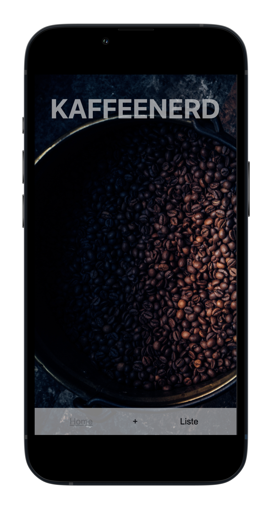
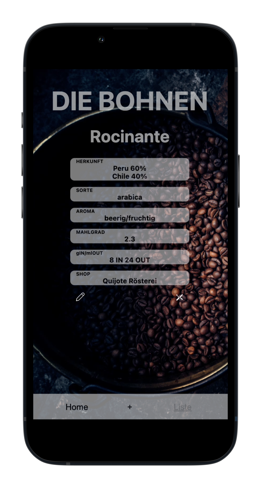

## Capstone Project: KaffeeNerd

### Demo:

On this [link](https://kaffee-nerd-tmwgnr.vercel.app/) you can find my web-app.

**remember, its a mobile first app.
At best you open it whit mobile device.**

### TechStack:

- React
- Next.js
- Styled Components
- MongoDB
- React component testing
- Jest
- npm
- Git

### How to setup?

- Clone this repository
- Install all dependencies with `$ npm install`
- Run app in dev mode with `$ npm run dev`
- Server: [http://localhost:3000/](http://localhost:3000/)
